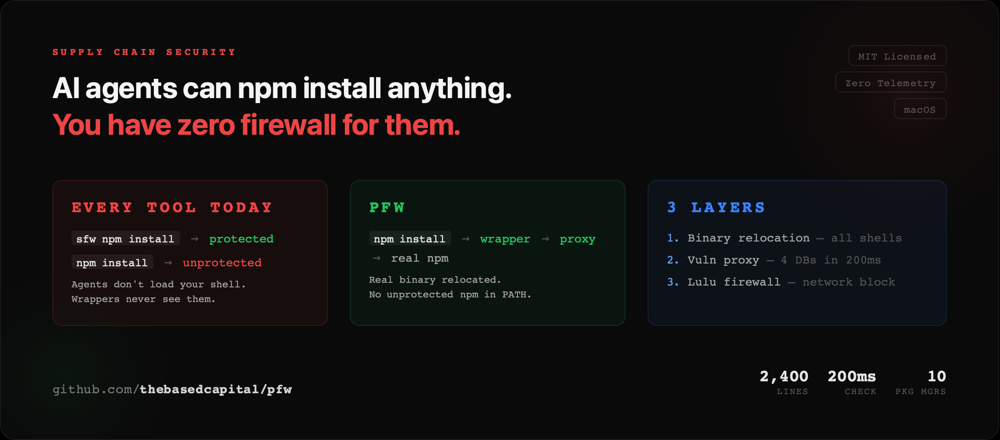
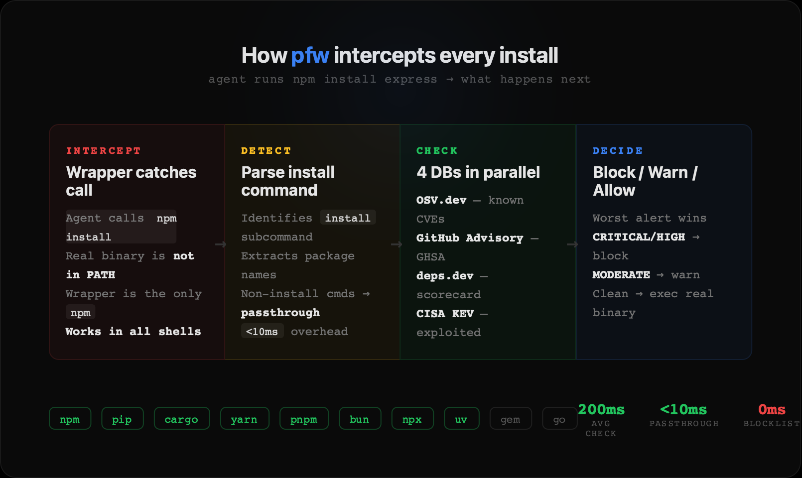

# pfw — Package Firewall

Self-hosted supply chain security for macOS. Zero telemetry. Three layers of defense.

 

**The problem:** AI agents and scripts run `npm install`, `pip install`, `cargo install` in non-interactive shells. Existing tools (Socket Firewall, Datadog SCFW, Aikido Safe Chain) only protect interactive shells via aliases — rogue agents bypass them trivially.

**pfw is different:** Binary relocation + system PATH enforcement + network-level firewall rules. Works for every shell, every script, every agent.

## How It Works



```
Agent runs: npm install malicious-pkg

Layer 1 — Wrapper:
  /usr/local/libexec/pfw/npm (wrapper) intercepts the call
  Detects "install" subcommand → routes through proxy daemon

Layer 2 — Daemon:
  HTTP proxy checks 4 vulnerability sources in parallel (~200ms):
  • OSV.dev (Google)
  • GitHub Advisory Database
  • deps.dev (OpenSSF Scorecard)
  • CISA KEV (actively exploited)
  → BLOCKED if vulnerable

Layer 3 — Lulu Firewall (optional):
  Network-level block on real binaries + curl/wget to registries
  Even direct /usr/local/libexec/pfw-real/npm invocation → no network
```

## Quick Start

```bash
# Install pfw
npm install -g pfw

# Check a package manually
pfw check npm lodash@4.17.21
pfw check pypi requests@2.31.0
pfw check cargo serde@1.0.210

# Start the daemon
pfw daemon start

# Activate full enforcement (requires sudo)
pfw install --yes

# Uninstall cleanly
pfw uninstall --yes
```

## What `pfw install` Does

| Step | What | Why |
|------|------|-----|
| 1 | Copy real npm/pip/cargo to `/usr/local/libexec/pfw-real/` | Preserve originals |
| 2 | Symlink wrappers at `/usr/local/libexec/pfw/` | Intercept all calls |
| 3 | Write `/etc/paths.d/00-pfw` | System-wide PATH priority |
| 4 | `launchctl config user path` | Persistent across reboots |
| 5 | Configure `.npmrc`, `pip.conf`, `cargo/config.toml` | Registry → proxy |
| 6 | Install launchd daemon | Auto-start on boot |
| 7 | Configure Lulu firewall rules | Network-level blocking |

## Supported Package Managers

npm, npx, yarn, pnpm, pip, pip3, uv, cargo, bun, bunx

## Vulnerability Sources

| Source | What It Catches | Latency |
|--------|----------------|---------|
| **OSV.dev** | Known CVEs across all ecosystems | ~100ms |
| **GitHub Advisory** | GHSA advisories with severity | ~100ms |
| **deps.dev** | Low OpenSSF Scorecard (unmaintained projects) | ~100ms |
| **CISA KEV** | Actively exploited vulnerabilities | ~0ms (cached) |

All sources queried in parallel. Typical total latency: **200-400ms**.

## Configuration

Create `~/.pfw.config`:

```bash
# Block known-compromised packages
BLOCK=event-stream
BLOCK=colors
BLOCK=ua-parser-js

# Warn on patterns
WARN=@deprecated/*

# Always allow
ALLOW=lodash
```

### Environment Variables

| Variable | Default | Description |
|----------|---------|-------------|
| `PFW_DEBUG` | `false` | Verbose logging |
| `PFW_FAIL_ACTION` | `allow` | `block`/`warn`/`allow` when API unreachable |
| `PFW_LOCAL_POLICY_ONLY` | `false` | Skip all external API calls |
| `PFW_BYPASS` | — | Requires token from `/etc/pfw-bypass.token` |

## Security Model

We used multiple LLMs to try to break and bypass this tool for checking robustness. 55 bugs found, 15 critical/high fixed.

### What pfw Catches

- All `npm/pip/cargo install` from any shell (interactive, non-interactive, scripts, cron, AI agents)
- `npx`/`bunx` remote package execution
- `npm exec`, `yarn dlx`, `pnpm dlx`
- Known-malicious packages (local blocklist, 0ms)
- CVE-listed vulnerabilities (OSV + GHSA)
- Unmaintained packages (OpenSSF Scorecard < 4.0)
- Actively exploited vulnerabilities (CISA KEV)

### What pfw Cannot Catch (honest)

- Direct `curl https://registry.npmjs.org/...` (mitigated by Lulu Layer 3)
- `docker run node npm install` (container isolation)
- Compiling from source
- Zero-day before any advisory exists (~2hr window)

## Lulu Integration

If [Lulu firewall](https://objective-see.org/products/lulu.html) is installed, `pfw install` automatically:

- Blocks real package manager binaries from making outbound connections
- Blocks `curl`/`wget` from reaching registry domains
- Covers 14 registry domains across all ecosystems

Install Lulu CLI: `brew install woop/tap/lulu-cli`

## License

MIT
